# PemogramanIntegratif

# Install Laravel- Pemograman Integratif

---
**Alvyano Rizqilla R - 1202190035**
---

### Install PHP

•	Download php on website https://windows.php.net/download#php-8.1. 

 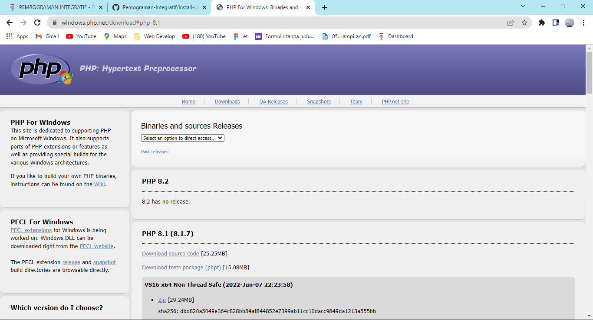

•	Then Extract the php file, find the file named `php.ini development`, rename the copy file to `php.ini`. after that open it using a text editor, and make it like in the picture, then save it.

  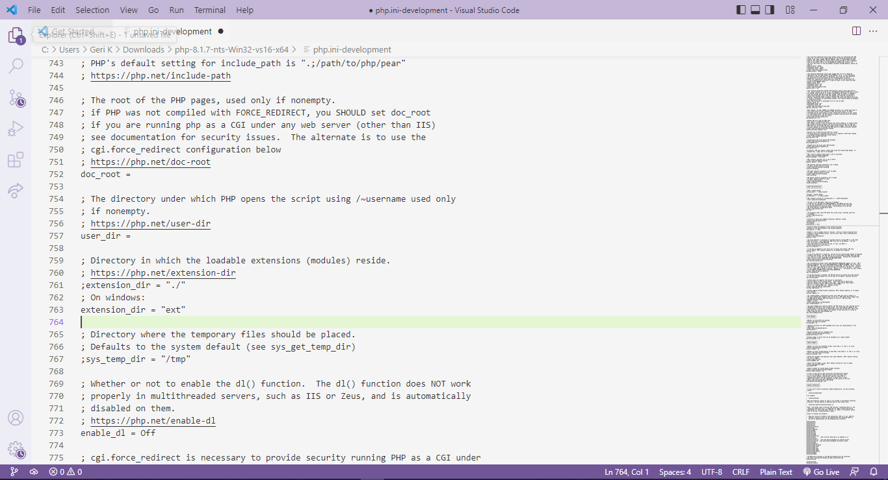

  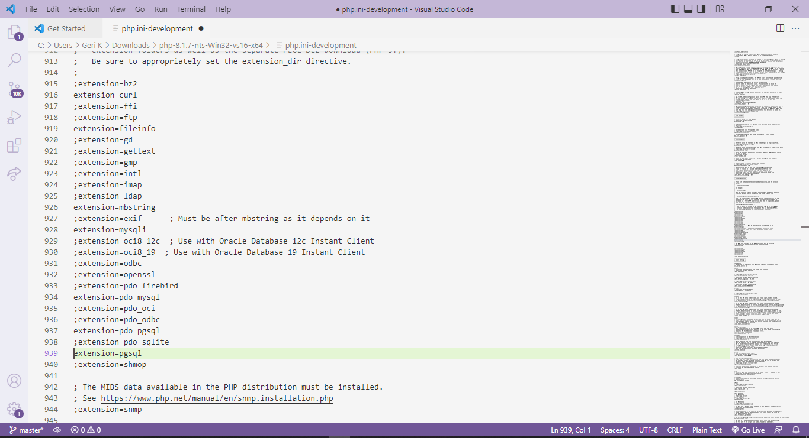

•	Open `Edit The System Environment Variables`, click `Environment Variables`

   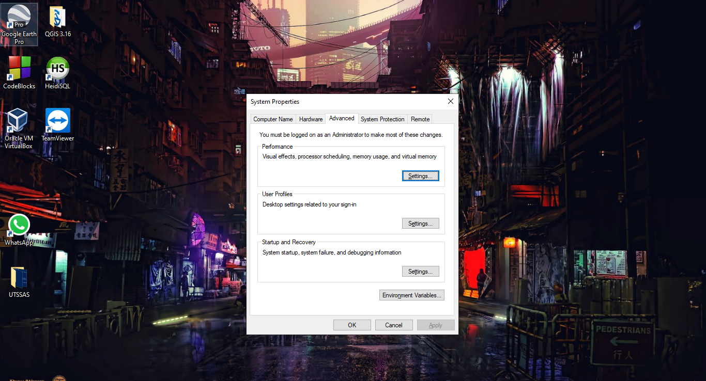

•	Select the path variable to add the address of the php file earlier, then select ok.

  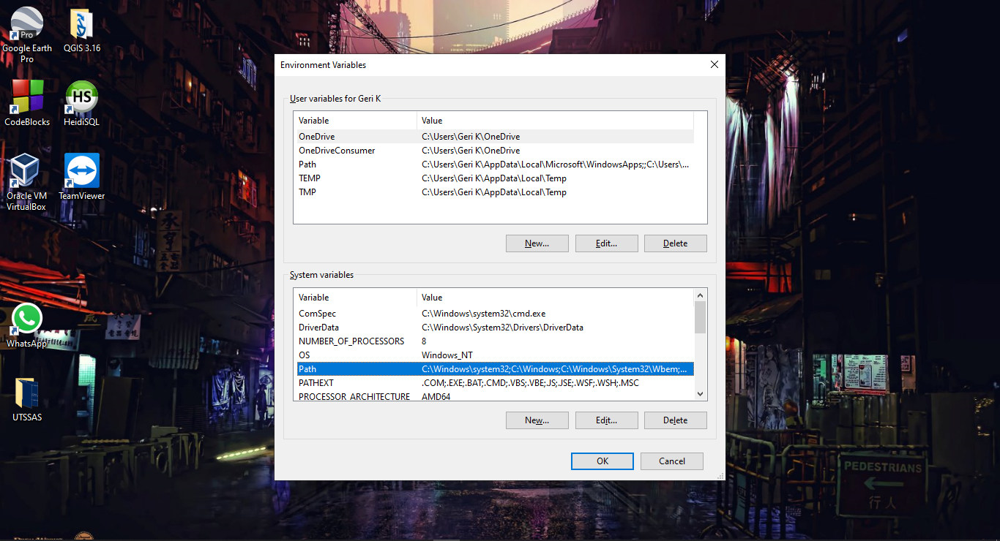

  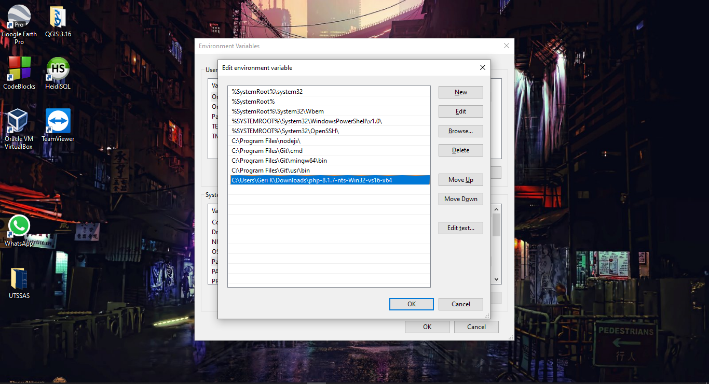

•	Open a terminal and type `php –v`, it will display a screen as shown, which means that php has been successfully installed.

  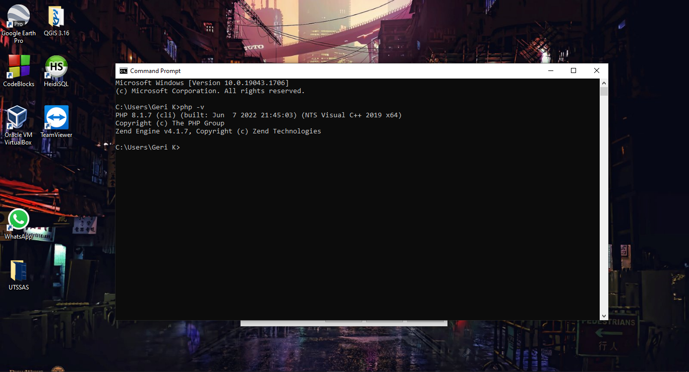
  
### INSTALL COMPOSER

•	Downlaod Composer https://getcomposer.org/download/

  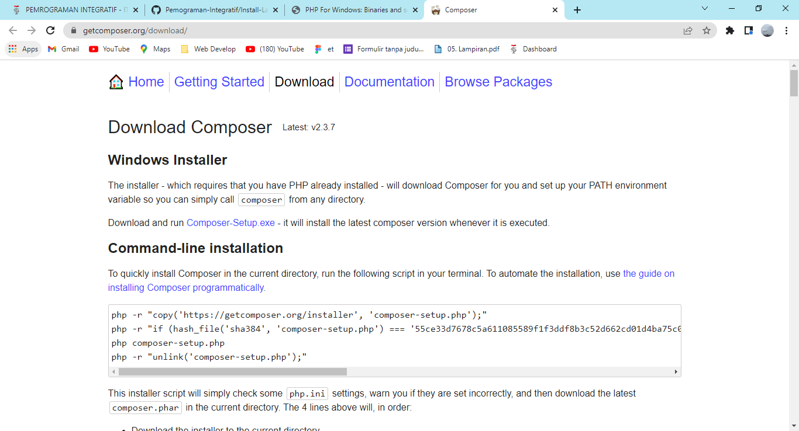

  
•	Install the composer file as usual. If you have opened a terminal and typed "composer", it will display a display as shown, where composer is already installed..

  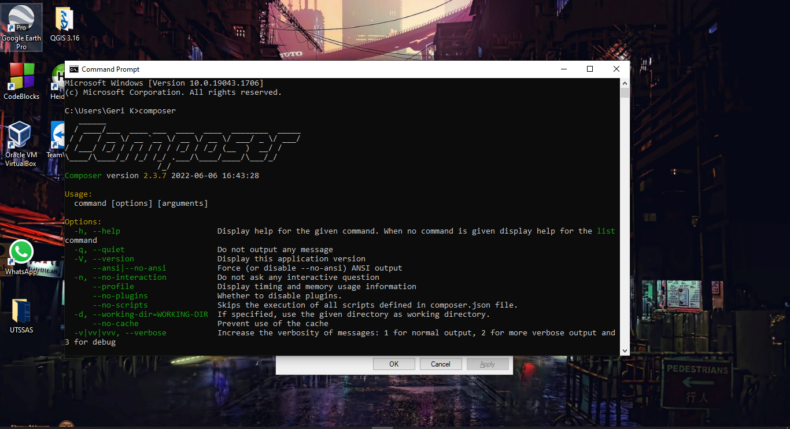

### INSTALL LARAVEL VIA COMPOSER

•	Create a project to install laravel with the command `composer create-project laravel/laravel name_project` and first go to the project folder that was created with the command `cd name_project/` And run the project with the command `php artisan serve`

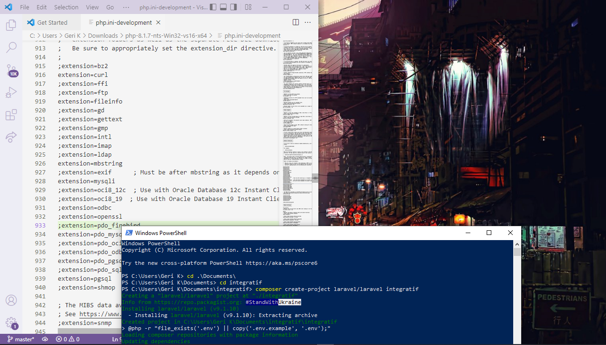

•   Check Laravel installation in web browser

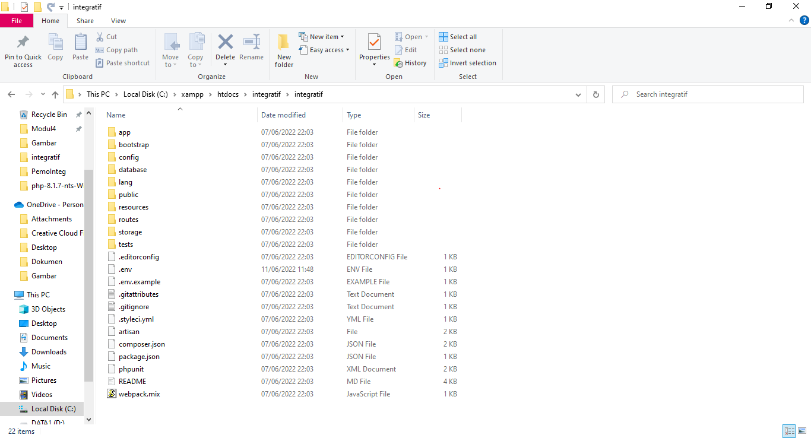

•	Copy laravel server, to open in browser
 
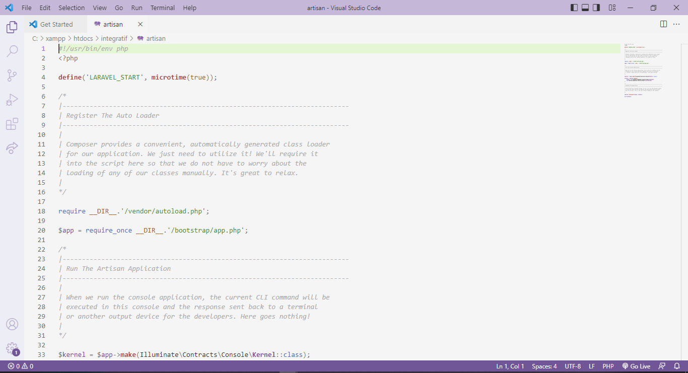

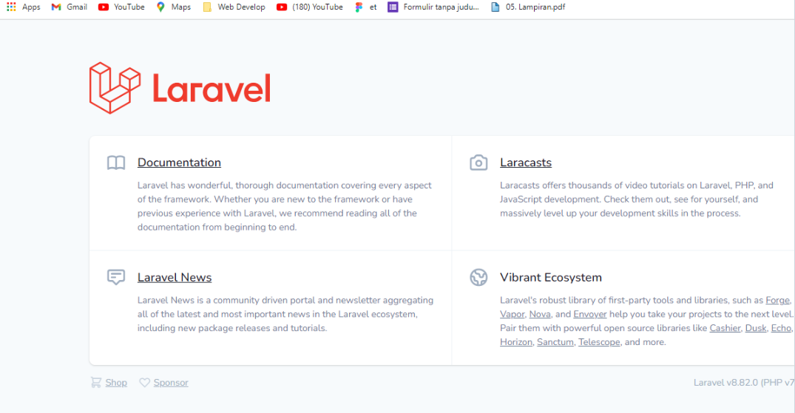

### Alvyano Rizqilla R - 1202190035

