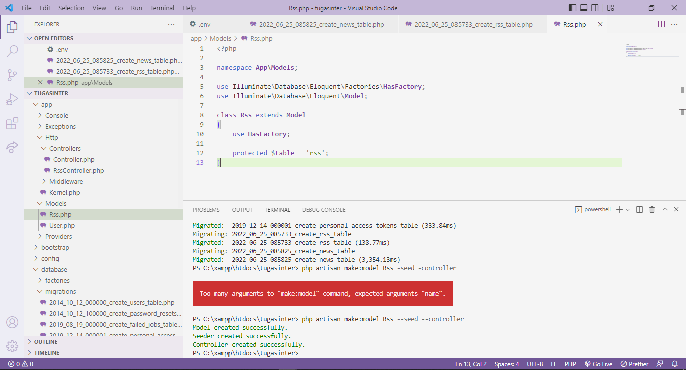
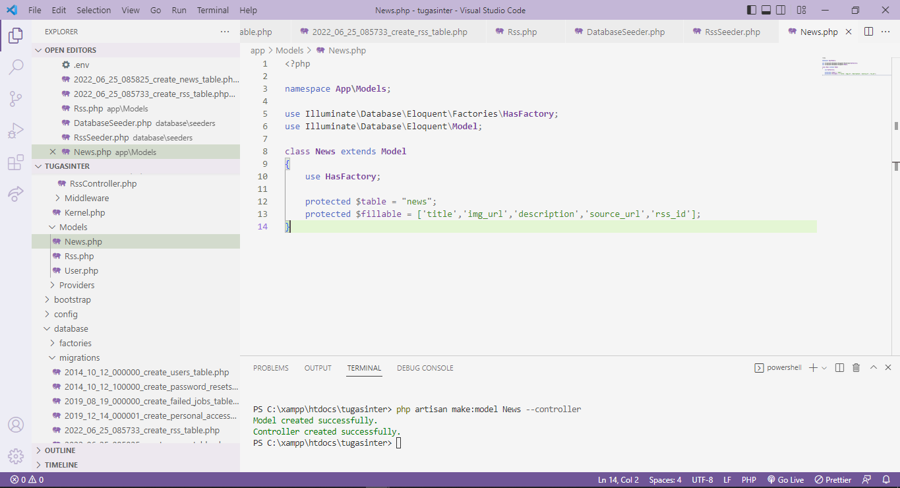
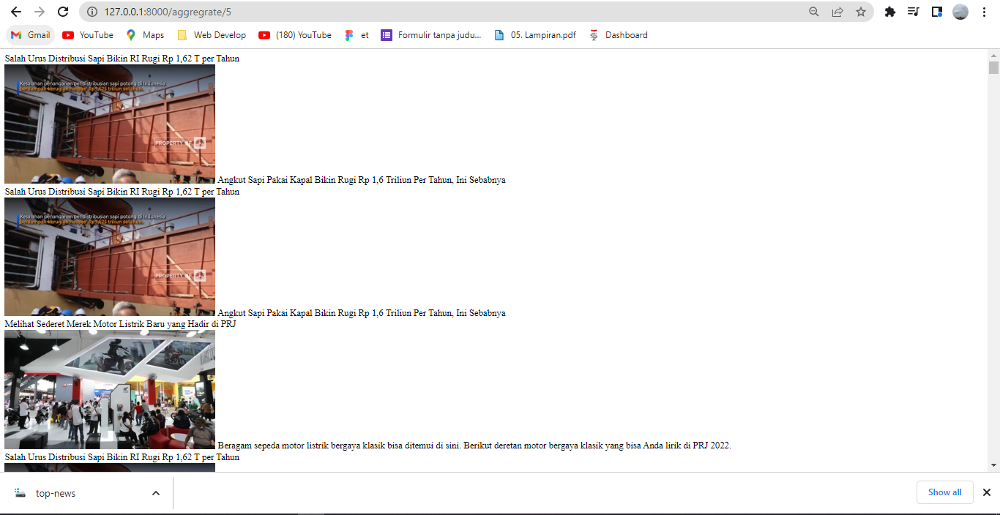

# PemogramanIntegratif

# Install Laravel- Pemograman Integratif

---
**Alvyano Rizqilla R - 1202190035**
---

### Install PHP

•	Download php on website https://windows.php.net/download#php-8.1. 

 

•	Then Extract the php file, find the file named `php.ini development`, rename the copy file to `php.ini`. after that open it using a text editor, and make it like in the picture, then save it.

  

  

•	Open `Edit The System Environment Variables`, click `Environment Variables`

   

•	Select the path variable to add the address of the php file earlier, then select ok.

  

  

•	Open a terminal and type `php –v`, it will display a screen as shown, which means that php has been successfully installed.

  
  
### INSTALL COMPOSER

•	Downlaod Composer https://getcomposer.org/download/

  

  
•	Install the composer file as usual. If you have opened a terminal and typed "composer", it will display a display as shown, where composer is already installed..

  

### INSTALL LARAVEL VIA COMPOSER

•	Create a project to install laravel with the command `composer create-project laravel/laravel name_project` and first go to the project folder that was created with the command `cd name_project/` And run the project with the command `php artisan serve`

•   Check Laravel installation in web browser

•	Copy laravel server, to open in browser
 

### Alvyano Rizqilla R - 1202190035

---
### **TAHAP 2 - RSS**
---

• Change DB_DATABASE in .env according to the database name created in phpmyadmin

• Create 2 tables rss and news with the migrations feature using the command

• Add the name and url columns to the rss table, as shown in the image below

• Add title, img_url, description, source_url, and rss_id columns to the news table, as shown in the image below

• To run the migration that was created, run the command in the terminal as below, then check the database

• Create model connection to database by creating seeders and controllers for Rss and News tables, with command

• Edit the Rss.php, RssSeeder.php and DatabaseSeeder.php files as shown in the image below

• Then check the connection with the command

• Edit the News.php file, News Controller.php, web.php, along with the News migration file as shown below

• Check localhost at http://127.0.0.1:8000/aggregrate/1 and in the phpmyadmin database

• Check localhost at http://127.0.0.1:8000/aggregrate/2 and in the phpmyadmin database

• Check localhost at http://127.0.0.1:8000/aggregrate/3 and in the phpmyadmin database

### **Alvyano Rizqilla R - 1202190035**
**HATUR NUHUN**

